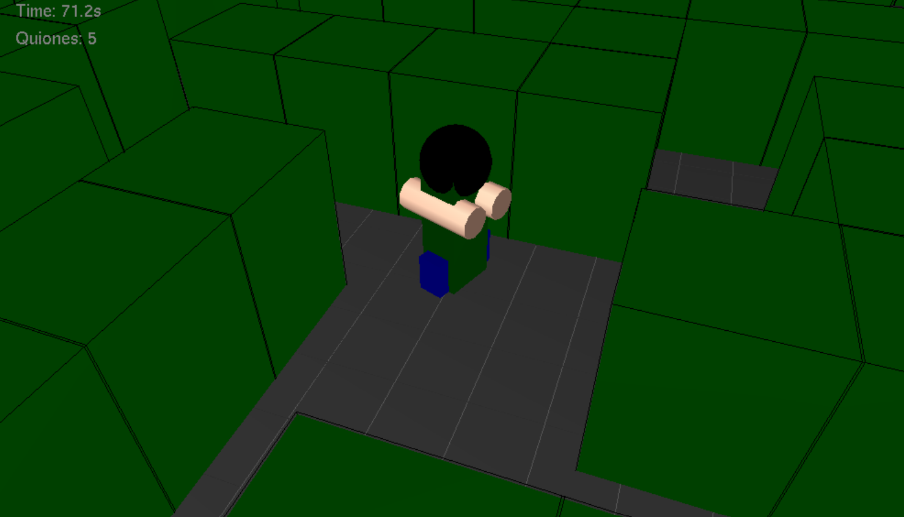
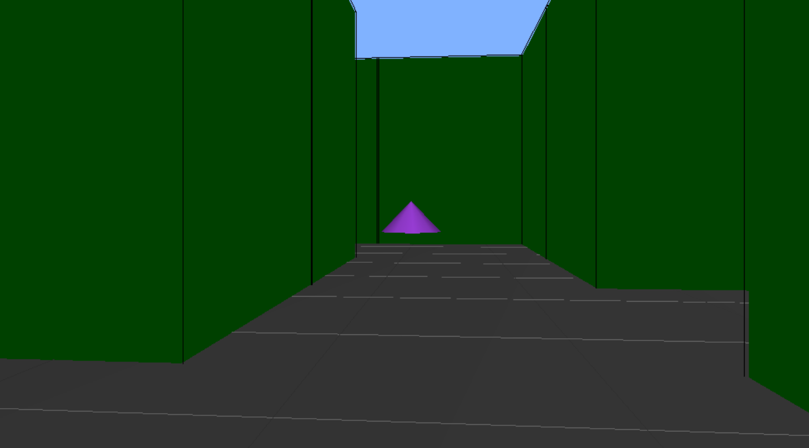
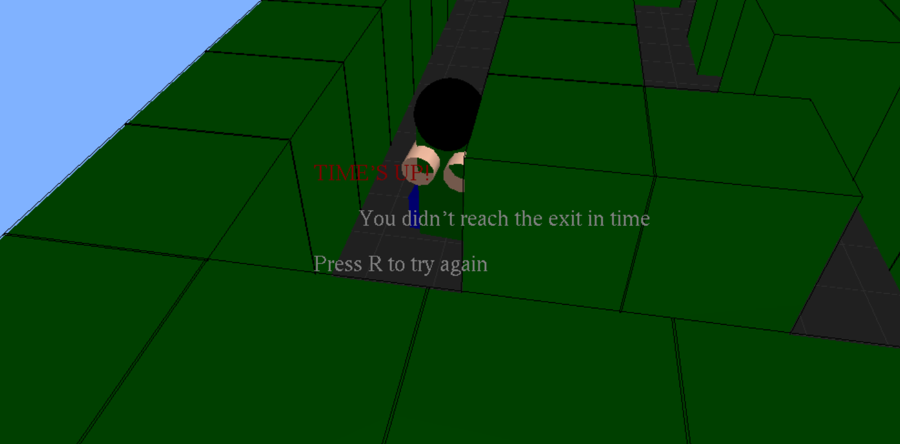

# 🌀 3D Maze Game

A 3D maze game built with Python and OpenGL. Navigate through a hand-crafted maze, dodge enemies, avoid time-stealing obstacles, and race to reach the exit before time runs out.

---

## 📸 Screenshots

| Third-Person View | First-Person View | Game Over |
|:-:|:-:|:-:|
|  |  |  |

---

## 🎮 Gameplay

- Navigate a **20×19 3D maze** with green walls and a dark floor
- Reach the **red cube** at the exit before the **120-second timer** runs out
- Avoid **enemies** that chase you — each hit costs a life
- Watch out for **Quiones** (purple cones) that spawn every 10 seconds and steal time if you touch them
- Earn up to **3 stars** based on your completion time

---

## ✨ Features

- 🧱 **3D rendered maze** using OpenGL with solid walls and lighting
- 👤 **Dual camera modes** — switch between third-person and first-person view
- 🤖 **Enemy AI** — enemies actively chase the player through the maze
- ⏱️ **Timed challenge** with star rating system
- ⚡ **Quiones** — hazard objects that penalize 5 seconds on contact
- 💡 **Cheat mode** with auto-follow toggle
- 🔄 **Instant restart** with `R` key

---

## 🕹️ Controls

| Key | Action |
|-----|--------|
| `W` | Move forward |
| `S` | Move backward |
| `A` | Rotate left |
| `D` | Rotate right |
| `↑ ↓ ← →` | Rotate camera |
| `Left / Right Click` | Toggle first/third person |
| `C` | Toggle cheat mode |
| `V` *(cheat mode on)* | Toggle auto-follow |
| `R` | Restart after game over |

---

## 🛠️ Installation

**1. Clone the repository**
```bash
git clone https://github.com/yourusername/3d-maze-game.git
cd 3d-maze-game
```

**2. Install dependencies**
```bash
pip install PyOpenGL PyOpenGL_accelerate
```

**3. Install FreeGLUT**

- **Windows:** Download from [transmissionzero.co.uk](https://www.transmissionzero.co.uk/software/freeglut-devel/) and place `freeglut.dll` in `C:\Windows\System32`
- **Linux:** `sudo apt-get install freeglut3-dev`
- **macOS:** `brew install freeglut`

**4. Run the game**
```bash
python main.py
```

---

## 🧩 Tech Stack

- **Python 3**
- **PyOpenGL** — 3D rendering (GL, GLU, GLUT)
- **FreeGLUT** — window and input management
- Built-in `math` and `random` — game logic

---

## ⭐ Star Rating System

| Time | Rating |
|------|--------|
| Under 45s | ⭐⭐⭐ |
| Under 75s | ⭐⭐ |
| Under 120s | ⭐ |
| 120s+ | No stars |

---

## 📁 Project Structure

```
3d-maze-game/
├── main.py               # Main game file
├── screenshots/          # Gameplay screenshots
│   ├── Screenshot_2026-06-20_185340.png
│   ├── Screenshot_2026-06-20_185210.png
│   └── Screenshot_2026-06-20_185007.png
└── README.md
```
